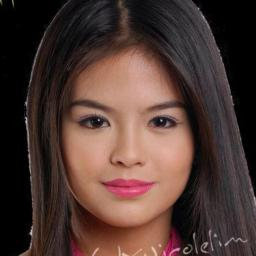
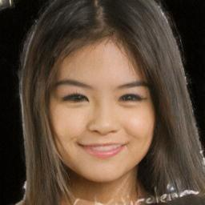
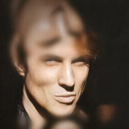
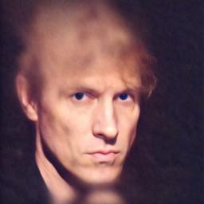
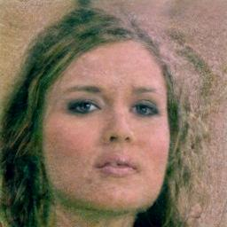

# GuidedDiffusion

Recently, it has been shown in the literature that using CLIP as a classifier to guide generative models like GAN and StyleGAN with text can lead to interesting results. Here, I've implemented a part of [DiffusionClip](https://github.com/gwang-kim/DiffusionCLIP) paper that proposed to use CLIP as a classifier to guide a denoising diffusion model.

Here, to generate the samples with guided text and clip classifier,  I only fine-tune the model for 2 epochs. The samples are generated during the fine-tuning phase. That means to generate every new sample, we have to fine-tune the model for that sample first. 

To use fewer GPU resources, the GPU-efficient fine-tuning approach in [DiffusionClip](https://github.com/gwang-kim/DiffusionCLIP) is only implemented.

Here, I also compare the generative results for using Emonet versus CLIP as the classifier to guide the diffusion model. To show that not all the classifiers are suitable to guide a generative model.

A part of this code is grabbed from [DiffusionClip](https://github.com/gwang-kim/DiffusionCLIP) original implementation. The DDPM implementation is downloaded from [https://github.com/explainingai-code/DDPM-Pytorch/tree/main](https://github.com/explainingai-code/DDPM-Pytorch/tree/main).

# Quick Start

* Create a new conda environment with Python 3.8, then run the following commands

* git clone https://github.com/azmozaffari/GuidedDiffusion.git

* cd GuidedDiffusion

* pip install -r requirements.txt

* Run the batch file run.sh by ./run.sh

* The target image folder is in ./data/training/target. Drop some CelebA images in this folder.

* Run main.py by python3 main.py --config celeba.yml

* See the results in ./data/trainig/output
   
# Configuration
* celeba.yml - Allows you to play with different components of the Guided Diffusion model

# Results
### CLIP results:
* original samples from CelebA dataset

  <table>
  <tr>
    <td> </td>
    <td> </td>
    <td> </td>
    <td> </td>
   </tr> 
  </table>

* Results after fine-tuning the diffusion model with CLIP classifier with guided text: "fearful face"
  <table>
     <tr>
    <td> </td>
    <td> </td>
    <td> </td>
    <td> </td>
   </tr>   
   </table>

* Results after fine-tuning the diffusion model with CLIP classifier with guided text: "happy face"
  <table>
     <tr>
    <td> </td>
    <td> </td>
    <td> </td>
    <td> </td>
   </tr> 
   </table>

### Emonet results:

* Results after fine-tuning the diffusion model with Emonet classifier to generate the images that maximizes the Fear output of the model.
  <table>
     <tr>
    <td> </td>
    <td> </td>
    <td> </td>
    <td> </td>
   </tr>   
   </table>

* Results after fine-tuning the diffusion model with Emonet classifier to generate the images that maximizes the Happy output of the model.
  <table>
     <tr>
    <td> </td>
    <td> </td>
    <td> </td>
    <td> </td>
   </tr> 
   </table>

# Disscusion
Not all the classifiers can guide the diffusion model effectively. CLIP as trained on a huge dataset, has better resistance to adversaries and can guide the model better than Emonet.
We should know that x0 predicted in each step of the diffusion model is guided to maximize the classifier output. Then, the classifier that is more robust to noisy images and adversaries leads to better results in this case.
